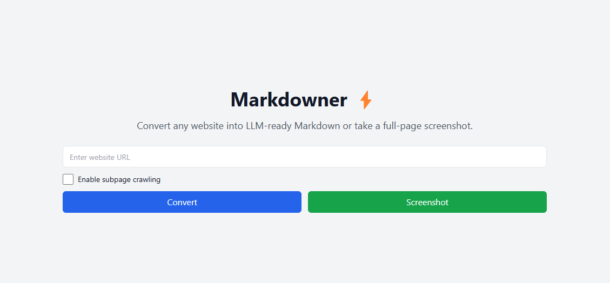
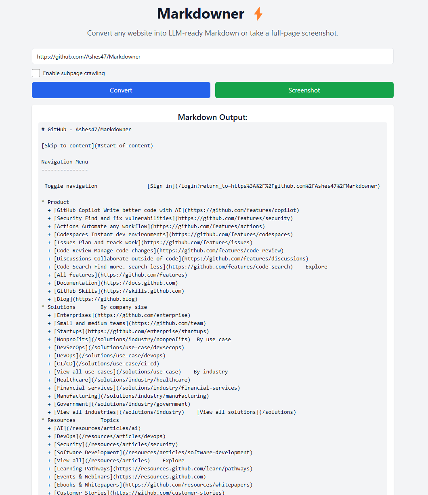
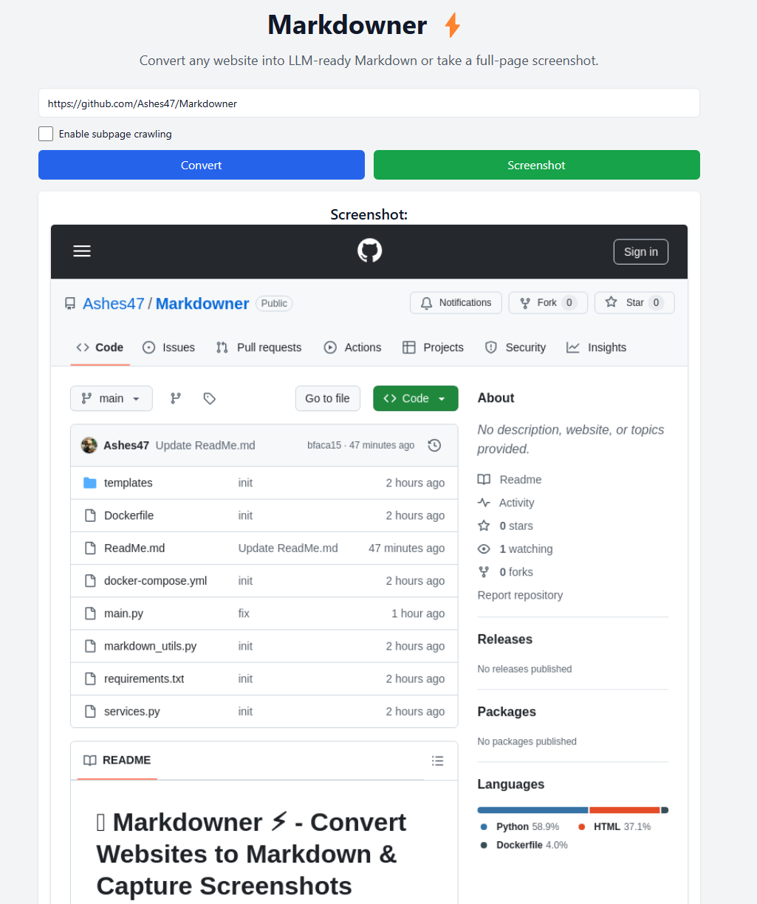

# 📝 Markdowner ⚡ - Convert Websites to Markdown & Capture Screenshots

**Markdowner ⚡** is a web tool that allows you to:
✅ Convert any website into **LLM-ready Markdown**
✅ Take **full-page screenshots** of webpages
✅ Download the extracted Markdown and images
✅ Supports **subpage crawling**

---

## 🚀 Features
### ✅ **Markdown Conversion**
- Extracts **clean, structured Markdown** from webpages
- Removes unnecessary elements (**scripts, styles**)
- Extracts **links, images, and metadata**
- Option to **crawl subpages**

### 📸 **Full-Page Screenshot Capture**
- Uses a **headless browser (Puppeteer)** to capture **full-page screenshots**
- Ensures **lazy-loaded content is fully rendered**
- Provides a **downloadable image file**

### ⚡ **Fast & Efficient**
- **Caches results** using **Redis** for instant retrieval
- Uses **async processing** for better performance
- Supports **multiple concurrent requests**

---
## 🛠️ Installation & Setup
### **1️⃣ Clone the Repository**
```sh
git clone https://github.com/Ashes47/Markdowner
cd Markdowner
```

### **3️⃣ Run with Docker**
**Using Docker Compose**
```sh
docker-compose up --build
```
This will start:
- **FastAPI server** on `http://localhost:8000`
- **Redis** for caching results  

---

## 🎯 API Endpoints
### **1️⃣ Convert Website to Markdown**
```http
GET /convert?url={website_url}&crawl_subpages={true/false}&subpage_limit={number}
```
#### 📌 **Example**
```http
GET http://localhost:8000/convert?url=https://example.com&crawl_subpages=true&subpage_limit=5
```
#### 🔹 **Response**
```json
{
  "url": "https://example.com",
  "markdown": "# Example Website\n\nSome content...",
  "file": "/download?file=12345678.md",
  "cached": false
}
```

---

### **2️⃣ Take a Screenshot**
```http
GET /screenshot?url={website_url}
```
#### 📌 **Example**
```http
GET http://localhost:8000/screenshot?url=https://example.com
```
#### 🔹 **Response**
```json
{
  "url": "https://example.com",
  "screenshot": "/download_screenshot?file=12345678.png"
}
```

---

### **3️⃣ Download Files**
#### 📥 **Markdown File**
```http
GET /download?file=12345678.md
```
#### 📸 **Screenshot File**
```http
GET /download_screenshot?file=12345678.png
```

---

## 🖥️ Frontend Usage
1. Enter a **URL** in the input box.
2. Click **"Convert"** to extract Markdown.
3. Click **"Screenshot"** to capture a full-page image.
4. Download the **Markdown file** or **screenshot image**.

---
## 🛠️ Tech Stack
- **Backend**: FastAPI 🚀
- **Frontend**: HTML, CSS, JavaScript 📝
- **Headless Browser**: Puppeteer (Pyppeteer) 🖥️
- **Caching**: Redis for **faster performance**

---

---
## Minimal UI (Optional)
 
 
 

## 📌 Future Improvements
- 🌍 **Multi-language Support**
- 🖼️ **OCR for Image-based Websites**
- 📂 **Store Results for History & Search**

---
## 💡 License
This project is licensed under the **MIT License**.

---